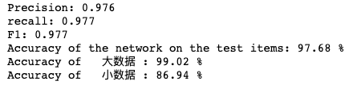
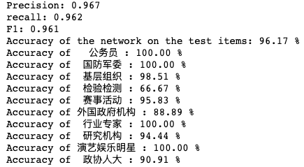

# 微博发声人鉴别

[**中文说明**](https://github.com/hawkforever5/BERT_User-Classification/blob/main/README.md) | [**English**](https://github.com/hawkforever5/BERT_User-Classification/blob/main/README_EN.md)

利用微博的用户数据对用户进行分类。

原数据共有24个分类：'超话粉丝大咖': 0, '公务员': 1, '大V名人': 2, '党委': 3, '国防军委': 4, '基层组织': 5, '政府': 6, '检验检测': 7, '媒体': 8, '民主党派': 9, '明星红人': 10, '企事业单位': 11, '赛事活动': 12, '社会组织': 13, '社区组织': 14, '司法机关': 15, '外国政府机构': 16, '网民': 17, '行业专家': 18, '学校': 19, '研究机构': 20, '演艺娱乐明星': 21, '政协人大': 22, '自媒体': 23

利用[哈工大讯飞联合实验室‘RoBERTa-wwm-ext-large’](https://github.com/ymcui/Chinese-BERT-wwm)模型。

- 实验发现对文本处理时统一长度对效果有明显的改善，在线性空间的视角下，词向量在同一维度下表示同一个文本属性，可能更利于分类器对空间的分割，从而获得了更好的效果。

## 对于数据的分析

标记数据1.2w条，由于数据量较少，适合采用BERT模型进行微调的策略。

剔除极端数据('明星红人', '民主党派')共有22类。

可利用信息包括昵称、关注数、粉丝数、微博数、认证信息、博主标记、简介、工作信息、标签和其他。

共9项，3项为整型数据，6项为字符型数据。

## 步骤

### 一、处理模型未涉及数据

'明星红人', '民主党派'两类数据过少，无法用模型进行训练，故需用规则剔除。

### 二、按训练集尺寸进行二分类（size_of_data）

训练集的各标签数据储存不一，在反向传播时会误导模型对参数的调整，故应以各标签的数据量为依据，将数据集分为大小数据集分开训练，实验证明，此方法对效果有明显的改善。

大数据：

```
社区组织
学校
媒体
党委
超话粉丝大咖
社会组织
自媒体
企事业单位
司法机关
网民
大V名人
政府
```

小数据：

```python
基层组织
演艺娱乐明星
赛事活动
公务员
研究机构
行业专家
检验检测
外国政府机构
政协人大
国防军委
```

实验结果：



修改 Config字典：'model_save_path': 'size_of_data.pth'

### 三、小数据十分类（small_data_10）

分出小数据后，直接进行10分类。

```python
基层组织
演艺娱乐明星
赛事活动
公务员
研究机构
行业专家
检验检测
外国政府机构
政协人大
国防军委
```

实验结果：



## 四、内积离群数据（distinctive_data）

大数据类中，个别标签在特征空间中具有明显的区分度，向量内积优秀，故可直接进行n+1分类将其解决。

